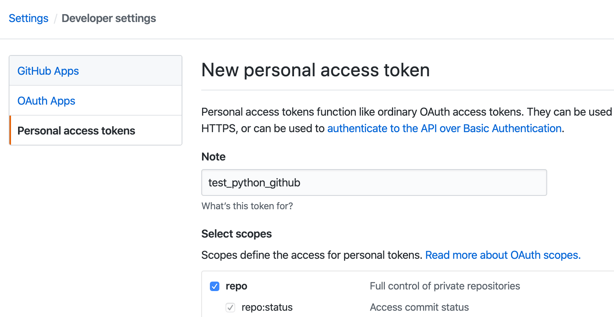

### Install: 
```bash
git clone "https://github.com/obnil/ProjectInitializationAutomation.git"
cd ProjectInitializationAutomation
pip install -r dependencies.txt
touch .env
Then open the .env file and store your username, token, and desired file destination. Use the provided format at the bottom of this README.
source ~/.my_commands.sh
```

### Usage:
```bash
To run the script type in 'create <name of your folder>'
To run the script type in 'delete <name of your folder>'
To run the script type in 'get'
```

#### create

```
NamiLindeMBP:~ namilin$ create flutter_test
[✓] Succesfully created repository flutter_test
Initialized empty Git repository in /Users/namilin/workspaces/python/flutter_test/.git/
[master (root-commit) 7d9a875] Initial commit
 1 file changed, 0 insertions(+), 0 deletions(-)
 create mode 100644 README.md
Counting objects: 3, done.
Writing objects: 100% (3/3), 205 bytes | 0 bytes/s, done.
Total 3 (delta 0), reused 0 (delta 0)
To github.com:obnil/flutter_test.git
 * [new branch]      master -> master
Branch master set up to track remote branch master from origin.
NamiLindeMBP:flutter_test namilin$
```

#### get

```
NamiLindeMBP:flutter_test namilin$ get
[✓] Get repositorys success
You have [21] repositorys
flutter_test
ProjectInitializationAutomation
NeteaseCloudMusic
Flutter-Music-Player
Flute-Music-Player
flutter_music_app
flutter_netease_music
...
```

#### delete then get

```
NamiLindeMBP:~ namilin$ delete flutter_test
[✓] Delete flutter_test success
NamiLindeMBP:~ namilin$ get
[✓] Get repositorys success
You have [20] repositorys
ProjectInitializationAutomation
NeteaseCloudMusic
Flutter-Music-Player
Flute-Music-Player
flutter_music_app
flutter_netease_music
...
```


### Env File Format:

```bash
USERNAME="obnil"
TOKEN="0897ec5b084cb43b433dba342d8e4a40abce13b8"
FILEPATH="/Users/namilin/workspaces/python/"
```
You can generate new token from https://github.com/settings/tokens/new




## Credits

This was originally a fork of [KalleHallden's ProjectInitializationAutomation](https://github.com/KalleHallden/ProjectInitializationAutomation), but I added more features and used [GitHub API](https://developer.github.com/v3/) instead of [selenium](https://github.com/baijum/selenium-python) and [PyGithub](https://github.com/PyGithub/PyGithub).

Thanks for @KalleHallden for the amazing work!
